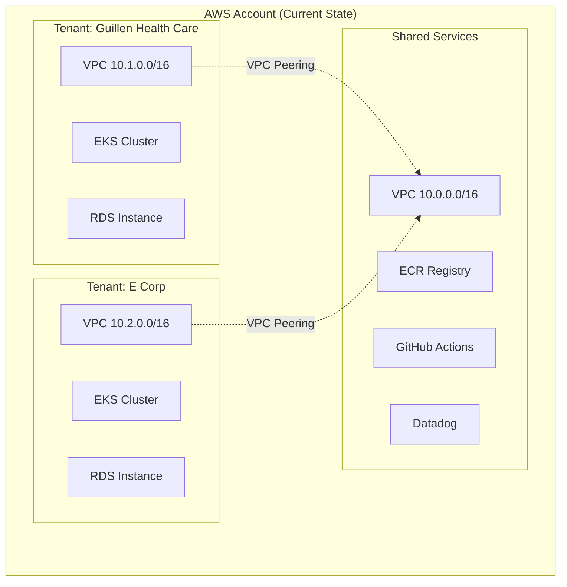
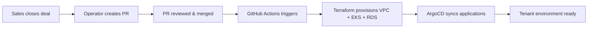
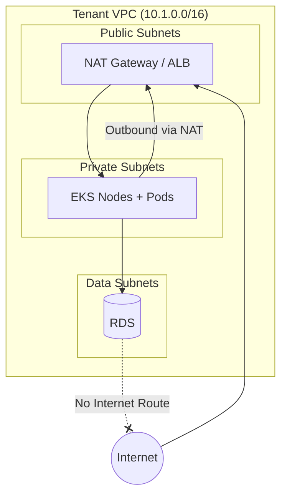
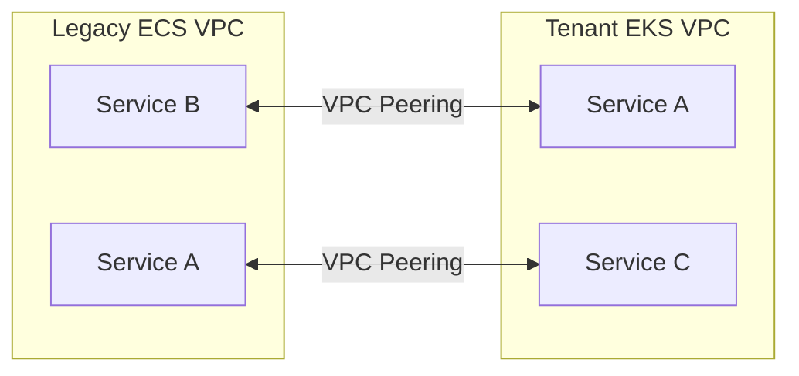

# WH EKS Multi-Tenant Architecture

## 1. Multi-Tenant Architecture

### Isolation Model

Each enterprise tenant receives a dedicated VPC and dedicated EKS cluster within a shared AWS account. This provides infrastructure-level isolation:
- Separate network boundaries
- Separate Kubernetes control planes
- Separate IAM roles per tenant

**Why not namespace isolation?**

Namespace isolation is logical separation only. A shared Kubernetes control plane becomes a single point of failure, and a misconfigured RBAC rule or missing network policy could expose one tenant's data to another. Especially for customers with SOC2 and/or HIPAA requirements, this is insufficient. Auditors expect infrastructure-level boundaries, not just application-level controls.

**Why not separate AWS accounts (at least not yet)?**

Separate AWS accounts per tenant is the ideal long term state given that it provides the strongest blast radius containment and simplifies compliance scoping. However, implementing AWS Organizations, Control Tower, and Account Factory is a meaningful lift. In 4 weeks, we provision a dedicated VPC and EKS cluster in an isolated OU within our existing account. When the time comes to move to clean separate accounts, this type of architecture will port smootly since the isolation boundaries are already correct.


### Tenant Provisioning

New tenants are provisioned via GitOps. The tenant configuration can arrive on intake forms and the opreator can then approve them, create a tenant configuration file, and submit a PR to the infrastructure repository. Ideally on merge, GitHub Actions triggers Terraform to provision:

- Isolated VPC with public, private, and data subnets across 2 AZs
- Dedicated EKS cluster with managed node groups
- Tenant-scoped IAM roles mapped to Kubernetes RBAC
- RDS instance in isolated data subnets
- Security groups enforcing least-privilege network access

ArgoCD (running in the new cluster) points to the source of truth (the infrastructure repo) and automatically syncs the base application stack (if configured to autosync). Total provisioning time target: ideally under 1 hour from merged PR to working environment.


**Automated vs. Manual:**

| Automated | Manual |
|-----------|--------|
| VPC, subnets, security groups | DNS verification / custom domain |
| EKS cluster + node groups | Customer IdP integration |
| IAM roles + RBAC mapping | |
| RDS instance | |
| Base application deployment | |

### Shared Services

Shared services are centralized for operational efficiency:

- **Logging/Monitoring:** Datadog with tenant-scoped tagging. Logs and metrics are labeled by tenant. Datadog RBAC restricts access so that WH operators see all tenants and tenant admins (customer IT staff) see only their own data
- **CI/CD:** GitHub Actions provisions infrastructure via Terraform. Application deployments are handled by ArgoCD running in each tenant cluster
- **Container Registry:** Shared ECR in the management account. Tenant clusters pull images via IAM roles scoped to read-only ECR access. This will require cross-account permissions/policies

## 2. EKS Cluster Design

### Node Group Strategy

Each tenant cluster runs two managed node groups:

| Node Group | Instance Type | Capacity Type | Purpose |
|------------|---------------|---------------|---------|
| `core` | m6i.large | On-Demand | System workloads (CoreDNS, Calico, ArgoCD, monitoring agents) |
| `workloads` | m6i.large | On-Demand | Application microservices |

Initial sizing: 2 nodes in `core`, 3 nodes in `workloads`, spread across 2 AZs. Cluster Autoscaler scales the `workloads` group based on pod demands

**Why On-Demand instead of Spot?**

Spot instances offer better cost savings. For enterprise customers paying for reliability and (especially) with compliance requirements, the move we start with is On-Demand. Spot can be introduced later for non-critical workloads once the platform is stable (happy to hear other opinions on this btw)

**Why m6i.large?**

A general-purpose instance with 2 vCPU and 8 GB RAM is a rough estimate but should be enough resources to run multiple pods per node without paying for capacity we don't need. Right-sizing can be adjusted after the fact

### Networking

**VPC Layout:**

Each tenant gets an isolated VPC with non-overlapping CIDR blocks:

| Tenant | CIDR |
|--------|------|
| Shared Services | 10.0.0.0/16 |
| Tenant 1 (Guillen Healthcare) | 10.1.0.0/16 |
| Tenant 2 (E Corp) | 10.2.0.0/16 |
| Tenant N | 10.N.0.0/16 |

**Subnet Strategy (per tenant VPC, 2 AZs):**

| Subnet Type | Example CIDRs | Purpose | Internet Access |
|-------------|---------------|---------|-----------------|
| Public | 10.1.0.0/20, 10.1.16.0/20 | NAT Gateways, Load Balancers | Yes (IGW) |
| Private | 10.1.32.0/20, 10.1.48.0/20 | EKS nodes, pods | Outbound only (NAT) |
| Data | 10.1.64.0/20, 10.1.80.0/20 | RDS, ElastiCache | None |

Data subnets have no route to the internet and will not even outbound through NAT. For example, if an attacker compromises a pod and attempts to exfiltrate data directly from RDS, there's no outbound path.


**CNI:**

AWS VPC CNI with Calico for network policy enforcement. VPC CNI assigns pods real VPC IP addresses, enabling native integration with security groups and VPC Flow Logs. Calico adds K8s NetworkPolicy support without the operational complexity of replacing the CNI entirely

**Ingress / Load Balancing:**

NGINX Ingress Controller running in the cluster, fronted by an AWS NLB. TLS termination at NGINX with certificates managed by cert-manager + LetsEncrypt (or ACM for customer-provided domains)

### Security Model

**RBAC:**

Tenant IAM roles are mapped to K8s groups via the `aws-auth` ConfigMap. Each tenant gets:

- A namespace (e.g., `guillen-workloads`) for their application pods
- A Kubernetes Role granting permissions within that namespace only
- A RoleBinding associating their IAM-mapped group to that Role

No tenant users receive ClusterRoleBindings. Cluster-wide access is reserved for platform operators

Example mapping (excerpt from ConfigMap):
```yaml
mapRoles:
  - rolearn: arn:aws:iam::123456789012:role/tenant-guillen-admin
    username: guillen-admin
    groups:
      - guillen-admins
```

**Network Policies:**

Default-deny ingress policy per tenant namespace. Pods can only receive traffic from:
- Other pods in the same namespace
- The ingress controller namespace (for external traffic)

Can include a whitelist policy if required (e.g., cross-namespace communication)

**Pod Security Standards:**

| Namespace Type | Enforce | Warn |
|----------------|---------|------|
| System (`kube-system`, `calico-system`) | Privileged | — |
| Tenant workloads | Baseline | Restricted |

Baseline blocks known privilege escalations (no hostNetwork, no privileged containers, no hostPath mounts). Restricted warnings surface pods that could be hardened further without breaking them (read: warning)

### Cluster Operations

**Upgrades:**

EKS releases new Kubernetes versions every 3-4 months. Upgrade process:

1. Upgrade non-prod tenant clusters first
2. Run validation suite (smoke tests, integration tests) if they exists... roughly 1 week for validation
3. Upgrade prod tenant clusters during a scheduled maintenance window
4. Node groups upgraded via rolling replacement... new nodes launch, old nodes drain and terminate

*Important note:* PodDisruptionBudgets ensure workloads maintain availability during node rotation

**Patching:**

- **Node OS:** EKS-optimized Amazon Linux AMIs (whatever is the latest). Monthly AMI updates via Terraform (need to enforce hard discipline on this task or automate), applied as rolling node group replacements
- **Cluster add-ons:** CoreDNS, kube-proxy, VPC CNI, etc. to be updated via Terraform when new versions are released and validated

**Backup/Restore:**

| Component | Backup Method | Retention |
|-----------|---------------|-----------|
| Cluster configuration | Terraform state in S3 (versioned, encrypted) | Indefinite |
| Application manifests | Git repository (ArgoCD source of truth) | Git history |
| RDS databases | Automated daily snapshots | 7 days (can be longer though for safety) |
| EBS volumes (PVCs) | AWS Backup daily snapshots | 7 days (also can be longer for safety) |

Restore process: Re-run Terraform to recreate cluster, ArgoCD syncs applications from Git, restore RDS from snapshot if needed. Can also have workflows that can destroy/recreate clusters

## 3. Migration Strategy

### Approach

New enterprise tenants are provisioned on EKS from day one. The existing single-tenant ECS deployment continues serving current customers. This will allow both current customers and new customers to run in parallel and also avoids an atomic migration. With this, EKS gets validated with the new customers first, and then existing customers can be migrated once the platform is battle-tested.

### Service Migration Order

When migrating services (for existing customers or for internal validation):

1. **Stateless, low-risk services first** :: This includes API gateways, frontends, internal tools. Easy to run in parallel and roll back if needed
2. **Stateless backend services next** :: Business logic that doesn't own data
3. **Stateful services last** :: Direct database connections, data pipelines, persistent connections. Highest risk—migrate only after the platform can be trusted

### Transition Period

During migration, some services run on ECS while others run on EKS. They need to communicate. Solution below...

**Solution:** VPC peering between legacy ECS VPC and tenant EKS VPCs. Security groups permit cross-VPC traffic on specific service ports. Peering is removed once migration is fully completed


### Rollback Plan

If something breaks after shifting traffic to EKS:

1. **Shift traffic back** :: Update Route 53 weights or ALB target groups to route back to ECS
2. **Keep ECS warm** :: Don't decommission ECS until EKS runs stable for 14 days
3. **Database consistency** :: Both ECS and EKS point to the same RDS during migration, so no data rollback needed

The gist is to Keep ECS running until EKS is proven

## 4. Prioritization

### What We Build (4 Weeks)

| Week | Focus | Deliverables |
|------|-------|--------------|
| 1-2 | Foundation | Tenant isolation module (VPC, subnets, SGs, IAM), EKS cluster, ArgoCD |
| 3 | Application | K8s manifests for 8 services, RDS, NGINX ingress + TLS |
| 4 | Review + Ship | Network policies, Pod Security Standards, Datadog, go-live |

### What We Defer

| Deferred | Why It's Acceptable |
|----------|---------------------|
| Separate AWS accounts per tenant (ideal) | VPC + cluster isolation meets compliance for now |
| Self-service portal | PR-based provisioning works for now. Also this is operator managed so less risk |
| Spot instances | Optimize costs after stability is proven and On-Demand is enough for now |
| Multi-region | Adds complexity. Would need to document in SLA |
| Automated compliance reporting | Manual responses until first SOC2 cycle (my experience has only been manual tbh, it would great to automate this someway) |